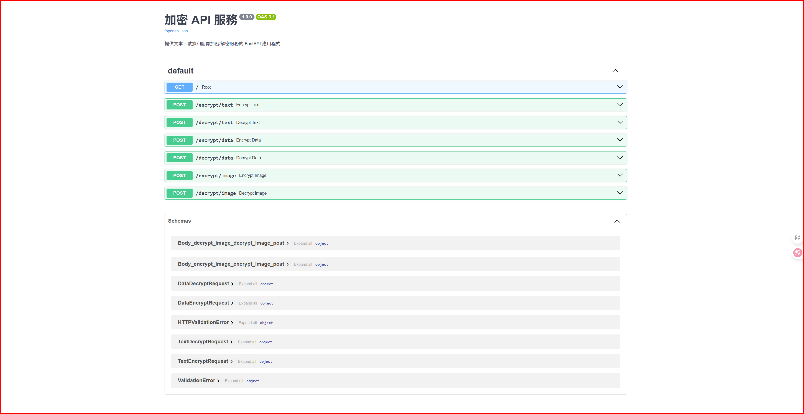

# 加密與處理 API 服務

一個基於 FastAPI 的全功能加密與處理服務，支持文本、數據和圖像的加密/解密、圖像變換、文本壓縮和哈希操作。



## 🌟 特性

### 🔐 加密功能
- **多種加密算法**：支持 AES 和 Fernet 加密算法
- **文本加密**：安全的文本加密和解密服務
- **數據加密**：通用數據加密，支持多種算法
- **圖像加密**：專門的圖像文件加密功能

### 🖼️ 圖像處理
- **圖像變換**：調整大小、旋轉、裁剪功能
- **圖像濾鏡**：模糊、邊緣增強、浮雕等多種效果
- **圖像增強**：亮度、對比度調整
- **格式轉換**：支持 JPEG、PNG、BMP、TIFF、WEBP 格式轉換
- **縮略圖生成**：快速創建縮略圖

### 🗜️ 文本壓縮
- **多種壓縮算法**：支持 gzip、zlib、bz2、lzma 壓縮
- **壓縮統計**：詳細的壓縮效果分析
- **算法比較**：自動比較不同壓縮算法的效果

### #️⃣ 哈希功能
- **多種哈希算法**：MD5、SHA1、SHA256、SHA512、SHA3、Blake2 等
- **Crunch Hash**：高強度哈希處理，結合鹽值和多次迭代
- **HMAC 支持**：基於密鑰的消息認證碼
- **文件哈希**：支持文件內容哈希計算

### 🚀 系統特性
- **RESTful API**：標準的 REST API 接口
- **安全性**：使用 PBKDF2 密鑰派生函數增強安全性
- **易於使用**：清晰的 API 文檔和響應格式

## 📁 項目結構

```
PasswordApp/
├── main.py                       # FastAPI 主應用程式
├── encryption/                   # 加密與處理模組目錄
│   ├── __init__.py              # 模組初始化文件
│   ├── text_encryption.py       # 文本加密模組
│   ├── data_encryption.py       # 數據加密模組
│   ├── image_encryption.py      # 圖像加密模組
│   ├── image_transformation.py  # 圖像變換模組
│   ├── text_compression.py      # 文本壓縮模組
│   └── hash_functions.py        # 哈希函數模組
├── requirements.txt             # Python 依賴項
└── README.md                   # 項目文檔
```

## 🚀 快速開始

### 1. 安裝依賴

```bash
pip install -r requirements.txt
```

### 2. 啟動服務

```bash
python main.py
```

或使用 uvicorn：

```bash
uvicorn main:app --host 0.0.0.0 --port 8000 --reload
```

### 3. 訪問 API

服務啟動後，可以通過以下地址訪問：

- **API 服務**：http://localhost:8000
- **API 文檔**：http://localhost:8000/docs
- **ReDoc 文檔**：http://localhost:8000/redoc

## 🔗 API 端點總覽

### 加密功能
- `POST /encrypt/text` - 文本加密
- `POST /decrypt/text` - 文本解密
- `POST /encrypt/data` - 數據加密
- `POST /decrypt/data` - 數據解密
- `POST /encrypt/image` - 圖像加密
- `POST /decrypt/image` - 圖像解密

### 文本壓縮
- `POST /compress/text` - 文本壓縮
- `POST /decompress/text` - 文本解壓
- `POST /compress/stats` - 壓縮統計
- `POST /compress/compare` - 算法比較

### 圖像變換
- `POST /transform/image/resize` - 調整大小
- `POST /transform/image/rotate` - 旋轉圖像
- `POST /transform/image/crop` - 裁剪圖像
- `POST /transform/image/filter` - 應用濾鏡
- `POST /transform/image/brightness` - 調整亮度
- `POST /transform/image/contrast` - 調整對比度
- `POST /transform/image/convert` - 格式轉換
- `POST /transform/image/thumbnail` - 創建縮略圖
- `POST /transform/image/info` - 獲取圖像信息

### 哈希功能
- `POST /hash/text` - 文本哈希
- `POST /hash/verify` - 哈希驗證
- `POST /hash/multi` - 多重哈希
- `POST /hash/crunch` - Crunch Hash
- `POST /hash/crunch/verify` - Crunch Hash 驗證
- `POST /hash/file` - 文件哈希

## 📚 API 端點

### 基本信息

#### GET `/`
獲取 API 服務基本信息和可用端點列表。

**響應示例：**
```json
{
  "message": "歡迎使用加密 API 服務",
  "endpoints": {
    "text_encrypt": "/encrypt/text",
    "text_decrypt": "/decrypt/text",
    "data_encrypt": "/encrypt/data",
    "data_decrypt": "/decrypt/data",
    "image_encrypt": "/encrypt/image",
    "image_decrypt": "/decrypt/image"
  }
}
```

### 文本加密

#### POST `/encrypt/text`
加密文本數據。

**請求體：**
```json
{
  "text": "要加密的文本",
  "password": "加密密碼"
}
```

**響應示例：**
```json
{
  "status": "success",
  "encrypted_text": "gAAAAABhXXXXXXXXXXXXXXXXXXXXXXXX...",
  "message": "文本加密成功"
}
```

#### POST `/decrypt/text`
解密文本數據。

**請求體：**
```json
{
  "encrypted_text": "gAAAAABhXXXXXXXXXXXXXXXXXXXXXXXX...",
  "password": "解密密碼"
}
```

### 數據加密

#### POST `/encrypt/data`
加密通用數據，支持多種算法。

**請求體：**
```json
{
  "data": "要加密的數據",
  "password": "加密密碼",
  "algorithm": "AES"  // 可選：AES 或 Fernet，默認為 AES
}
```

#### POST `/decrypt/data`
解密通用數據。

**請求體：**
```json
{
  "encrypted_data": "加密後的數據",
  "password": "解密密碼",
  "algorithm": "AES"  // 必須與加密時使用的算法一致
}
```

### 圖像加密

#### POST `/encrypt/image`
加密圖像文件。

**請求參數：**
- `password`：字符串，加密密碼
- `file`：上傳的圖像文件

**響應：**
返回加密後的文件下載。

#### POST `/decrypt/image`
解密圖像文件。

**請求參數：**
- `password`：字符串，解密密碼  
- `file`：上傳的加密文件（.enc 格式）

**響應：**
返回解密後的圖像文件。

### 文本壓縮

#### POST `/compress/text`
壓縮文本數據。

**請求體：**
```json
{
  "text": "要壓縮的文本內容",
  "algorithm": "gzip",  // 可選：gzip, zlib, bz2, lzma
  "level": 6           // 可選：壓縮級別 1-9
}
```

#### POST `/decompress/text`
解壓文本數據。

**請求體：**
```json
{
  "compressed_text": "壓縮後的文本",
  "algorithm": "gzip"  // 必須與壓縮時使用的算法一致
}
```

### 圖像變換

#### POST `/transform/image/resize`
調整圖像大小。

**請求參數：**
- `width`：目標寬度
- `height`：目標高度
- `maintain_aspect`：是否保持縱橫比（默認 true）
- `file`：圖像文件

#### POST `/transform/image/filter`
應用圖像濾鏡。

**請求參數：**
- `filter_name`：濾鏡名稱（BLUR, CONTOUR, DETAIL, EDGE_ENHANCE, EMBOSS, SMOOTH）
- `file`：圖像文件

### 哈希功能

#### POST `/hash/text`
計算文本哈希值。

**請求體：**
```json
{
  "text": "要計算哈希的文本",
  "algorithm": "sha256"  // 可選：md5, sha1, sha256, sha512 等
}
```

#### POST `/hash/crunch`
使用 Crunch Hash 算法（高強度哈希）。

**請求體：**
```json
{
  "data": "要處理的數據",
  "salt": "可選的鹽值",
  "iterations": 10000,    // 迭代次數
  "algorithm": "sha256"   // 哈希算法
}
```

## 🔧 使用示例

### Python 客戶端示例

```python
import requests
import json

# API 基礎 URL
BASE_URL = "http://localhost:8000"

# 文本加密示例
def encrypt_text_example():
    url = f"{BASE_URL}/encrypt/text"
    data = {
        "text": "這是一個秘密訊息",
        "password": "my_secret_password"
    }
    response = requests.post(url, json=data)
    print("加密響應:", response.json())
    return response.json()["encrypted_text"]

# 文本解密示例
def decrypt_text_example(encrypted_text):
    url = f"{BASE_URL}/decrypt/text"
    data = {
        "encrypted_text": encrypted_text,
        "password": "my_secret_password"
    }
    response = requests.post(url, json=data)
    print("解密響應:", response.json())

# 圖像加密示例
def encrypt_image_example():
    url = f"{BASE_URL}/encrypt/image"
    with open("example.jpg", "rb") as f:
        files = {"file": ("example.jpg", f, "image/jpeg")}
        data = {"password": "image_password"}
        response = requests.post(url, files=files, data=data)
    
    # 保存加密文件
    with open("encrypted_image.enc", "wb") as f:
        f.write(response.content)
    print("圖像加密完成")

# 執行示例
if __name__ == "__main__":
    # 加密和解密文本
    encrypted = encrypt_text_example()
    decrypt_text_example(encrypted)
    
    # 加密圖像（需要有 example.jpg 文件）
    # encrypt_image_example()
```

### cURL 示例

```bash
# 文本加密
curl -X POST "http://localhost:8000/encrypt/text" \
     -H "Content-Type: application/json" \
     -d '{"text": "Hello World", "password": "mypassword"}'

# 數據加密（使用 Fernet 算法）
curl -X POST "http://localhost:8000/encrypt/data" \
     -H "Content-Type: application/json" \
     -d '{"data": "Important data", "password": "mypassword", "algorithm": "Fernet"}'

# 圖像加密
curl -X POST "http://localhost:8000/encrypt/image" \
     -F "password=imagepass" \
     -F "file=@image.jpg" \
     -o encrypted_image.enc

# 文本壓縮
curl -X POST "http://localhost:8000/compress/text" \
     -H "Content-Type: application/json" \
     -d '{"text": "This is a long text that will be compressed", "algorithm": "gzip"}'

# 圖像調整大小
curl -X POST "http://localhost:8000/transform/image/resize" \
     -F "width=800" \
     -F "height=600" \
     -F "maintain_aspect=true" \
     -F "file=@image.jpg" \
     -o resized_image.png

# 計算文本哈希
curl -X POST "http://localhost:8000/hash/text" \
     -H "Content-Type: application/json" \
     -d '{"text": "Hello World", "algorithm": "sha256"}'

# Crunch Hash 計算
curl -X POST "http://localhost:8000/hash/crunch" \
     -H "Content-Type: application/json" \
     -d '{"data": "sensitive data", "iterations": 10000}'
```

## 🔐 安全特性

1. **PBKDF2 密鑰派生**：使用 100,000 次迭代增強密碼安全性
2. **隨機鹽值**：每次加密使用不同的隨機鹽值
3. **安全算法**：支持 AES-256 和 Fernet 加密算法
4. **數據完整性**：包含文件頭和大小驗證
5. **內存安全**：使用臨時文件處理大型數據

## 🛠️ 支持的算法

### 文本加密
- **Fernet**：對稱加密算法，提供身份驗證和完整性保護

### 數據加密
- **AES-256-CBC**：高級加密標準，256位密鑰，CBC 模式
- **Fernet**：基於 AES-128 的高級對稱加密

### 圖像加密
- **AES-256-CBC**：專門優化的圖像數據加密

### 圖像處理
- **PIL/Pillow**：強大的圖像處理庫，支持多種格式和變換
- **濾鏡效果**：內建多種圖像濾鏡和增強算法

### 文本壓縮
- **gzip**：快速通用壓縮算法
- **zlib**：輕量級壓縮庫
- **bz2**：高壓縮比的塊排序壓縮
- **lzma**：高效的 LZMA 壓縮算法

### 哈希算法
- **傳統算法**：MD5、SHA1、SHA256、SHA512
- **SHA-3 系列**：SHA3-224、SHA3-256、SHA3-384、SHA3-512  
- **Blake2**：高性能的現代哈希算法

## 📝 開發說明

### 添加新的加密算法

1. 在相應的加密模組中添加新的方法
2. 更新 `supported_algorithms` 列表
3. 在主 API 中添加相應的處理邏輯

### 環境變量配置

可以創建 `.env` 文件來配置環境變量：

```env
# 服務器配置
HOST=0.0.0.0
PORT=8000
DEBUG=False

# 安全配置
SECRET_KEY=your-secret-key-here
ALGORITHM_DEFAULT=AES
```

## 🐛 故障排除

### 常見問題

1. **依賴安裝失敗**
   ```bash
   pip install --upgrade pip
   pip install -r requirements.txt
   ```

2. **端口被占用**
   ```bash
   # 修改端口
   uvicorn main:app --port 8001
   ```

3. **加密/解密失敗**
   - 確保密碼正確
   - 檢查算法類型是否一致
   - 驗證輸入數據格式

## 📄 授權

此項目使用 MIT 授權條款。詳見 LICENSE 文件。

## 🤝 貢獻

歡迎提交 Issue 和 Pull Request 來改進此項目。

## 📞 聯繫方式

如有問題或建議，請通過以下方式聯繫：

- 創建 GitHub Issue
- 發送郵件至：[your-email@example.com]

---

**注意：** 請妥善保管您的加密密碼，密碼丟失將無法恢復加密數據。 